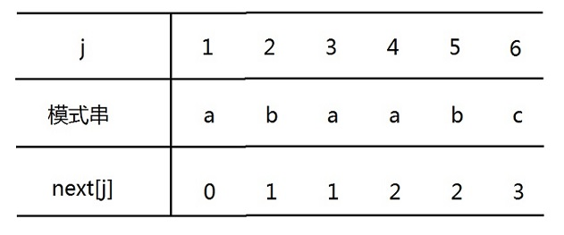
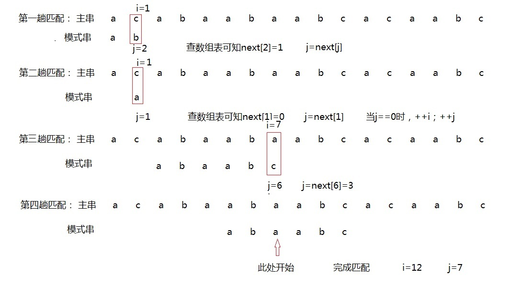
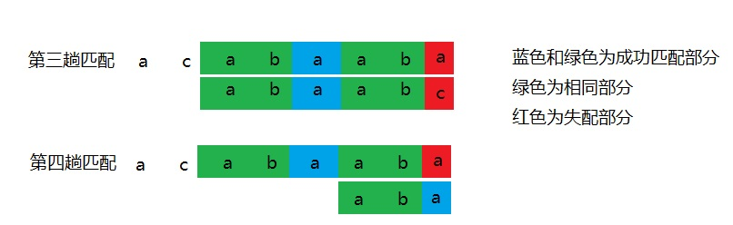

# 串的模式匹配：朴素的模式匹配算法，KMP算法

子串的定位操作通常称为串的模式匹配，它是各种串处理系统中最重要的操作之一，例如很多软件，若有“编辑”菜单项的话，则其中必有“查找”子菜单项。子串定位算法即称为模式匹配算法。

## 朴素的模式匹配算法
这种算法很简单，就是子串和主串进行对应位置的匹配，如果发生失配，那么主串和子串都进行回溯，主串回溯到开始匹配位置数目加一，子串回溯到零。
```cpp
void HStringIndex(HString *s,HString *t) {                
    int i = 0,j = 0;  
    while (i < s->length &&j < t->length) {  
        if (s->str[i] == t->str[j]) {  
            i++;   
            j++;  
        }  
        else {  
            i = i - j + 1;  
            j = 0;  
        }  
     }  
    if (j == t->length) {  
        cout << "子串的位置为:" << i-t->length + 1 << endl;  
    }  
    else {  
        cout << "没有该子串！" << endl;  
    }  
}  
```

## KMP算法
我先前看了好几篇博客还是有点懵。有些人写得太复杂了，推理过程一大堆，我顺着过程反而越绕越深，本来看东西就不细致的我更加不想看了。弄了几天，我不敢说全部，大部分是懂了。下面我就以我最简单明了的方法来说说我的理解，如果有错误，还请大家能指出来，共同进步嘛。

KMP算法最难理解的其实是next数组的计算方法，核心也是他，弄懂了next数组，KMP就基本没什么问题了。我看到其它博客都是从介绍KMP的用法开始，再介绍next数组的原理。我也按照这个思路来写吧，你们看到也好 理解。

KMP算法是由K什么，P什么，M什么三个人发明的一种对朴素的模式匹配算法的改进算法，它的特点是主串无需回溯。它只需要模式串按照next数组存储的数字移动，用模式串相应位置的字符和主串进行比较就可以了。举个书上的例子把：
- 主串：acabaabaabcacaabc
- 模式串：abaabc
- next数组：（这里存储的是模式串失配时，下一匹配字符的位置）
  


  上面的next数组我会在下面详细介绍怎么来的，你也可以自己去推。现在只需要知道有这么个东西，怎么在KMP算法里面用它就可以了。下面我会贴出代码，你可以推理过程，代码一起看，这样容易理解。

```cpp
void KMP(HString *s,HString *t) {		//s是主串，t是模式串
	int i=0, j=1;
	while (i < s->length && j <= t->length) {	//只要i,j小于各自串的长度，说明它们还没有匹配完
		if (j == 0 || s->str[i] == t->str[j - 1]) {	
			i++; j++;		//如果j==0，说明该位置字符与模式串首字符失配，都自增一。
		}		                //第二个条件满足，说明对应位置字符相同，继续比较后继字符
		else j = nextNum[j];	        //否则模式串移动相应的个数
	}
	if (j>t->length) {			
		cout << "子串的位置为：	" << i - t->length + 1 << endl;
	}
	else {
		cout << "没有该子串！" << endl;
	}
}
```

这里需要注意，nextNum[]就是next数组，因为命名冲突，所以没有直接起。字符数组是从0开始的，而nextNum[ ]是从1开始的，nextNum[0]并没有使用。




知道怎么用了，我们再讲讲原理。模式串字符的排列我们是已知的，但是如何去利用它呢？在这种具有重复字符的模式串里面，我们总能找到相同的部分。比如上图第三趟匹配到第四趟匹配过程中，他们的相同部分是a b。



有相同部分再进行匹配是不是比失配就回溯节约时间。现在关键来了，我们都是利用模式串预先计算出来的next数组来实现的，那我们怎么来计算next数组里面的值呢？

我先贴出代码：
```cpp
void Next(HString *t) {
	int i = 1, j = 0;
	nextNum[1] = 0;
	while (i<t->length) {
		if (j == 0 || t->str[i - 1] == t->str[j - 1]) {
			++i;
			++j;
			nextNum[i] = j;		
		}
		else {
			j = nextNum[j];	//回溯，在新的子串里面查找新的最大相同子串
		}
	}
}
```

在这个算法里面所求得的nextNum数组，nextNum[1]=0,nextNum[2]=1,这是默认的。

很显然，当模式串第一个字符都失配，我不能让模式串去移动下一位，那只能主串匹配位置自增一，继续匹配。
当模式串第二个字符失配时，那只能看第一个字符能否匹配，如果可以，继续匹配后继字符；不能，那主串匹配位置自增一。

核心就是从next数组的第三位值开始，值得大小取决于之前的字符从首尾开始组成最大的相同子串的长度，如果找到，那么next值是该长度加1，否则next值是1。


例如 :   
| | | | | | | | 
|  ----  | ---- | ---- | ---- | ---- | ---- | ----  |
| 模式串 | a | b | a | a | b | c |
| nextNum[] | 0 | 1 | 1 | 2 | 2 | 3 |
  
- 第二个字符失配也可以这么理解，字符组合：{0 | a}   最大相同子串为空,nextNum[2]=0+1;
- 第三个字符,  字符组合                    {0,a| b,0}.                   最大相同子串为空，nextNum[3]=0+1;
- 第四个字符，字符组合              {0,a,ab | ba,a,0}.              最大相同子串为a，长度为1，nextNum[4]=1+1;
- 第五个字符，字符组合        {0,a,ab,aba | baa,aa,a,0}.       最大相同子串为a，长度为1，nextNum[5]=1+1;
- 第六个字符，字符组合{0,a,ab,aba,abaa|baab,aab,ab,a,0}最大相同子串为ab，长度为2，
  nextNum[6]=2+1;
花括号前半部分是除尾字符的所有子串字符组合，后半部分是除首字符的所有子串组合。
### 代码
```cpp
#include<iostream>
using namespace std;
#define max 100
int nextNum[max];
typedef struct {
	int length;
	char *str;
}HString;
void Next(HString *t) {
	int i = 1, j = 0;
	nextNum[1] = 0;
	while (i<t->length) {
		if (j == 0 || t->str[i - 1] == t->str[j - 1]) {
			++i;
			++j;
			nextNum[i] = j;
		}
		else {
			j = nextNum[j];
		}
	}
}
void KMP(HString *s,HString *t) {
	int i=0, j=1;
	while (i < s->length && j <= t->length) {	//只要i,j小于各自串的长度，说明它们还没有匹配完
		if (j == 0 || s->str[i] == t->str[j - 1]) {	
			i++; j++;				//如果j==0，说明该位置字符与模式串首字符失配，都自增一。
		}		//第二个条件满足，说明对应位置字符相同，继续比较后继字符
		else j = nextNum[j];			//否则模式串移动相应的个数
	}
	if (j>t->length) {			
		cout << "子串的位置为：	" << i - t->length + 1 << endl;
	}
	else {
		cout << "没有该子串！" << endl;
	}
}
void main() {
	HString s1,s2;
	s1.length = 17;
	s1.str = (char*)malloc(sizeof(char));
	s1.str = "acabaabaabcacaabc";
	s2.length = 6;
	s2.str = (char*)malloc(sizeof(char));
	s2.str = "adacba";
	Next(&s2);
	KMP(&s1, &s2);
	for (int i = 1; i < 7; i++) {
		cout << nextNum[i];
	}
	system("pause");
}
```

