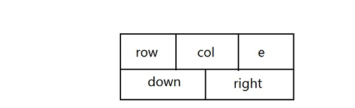
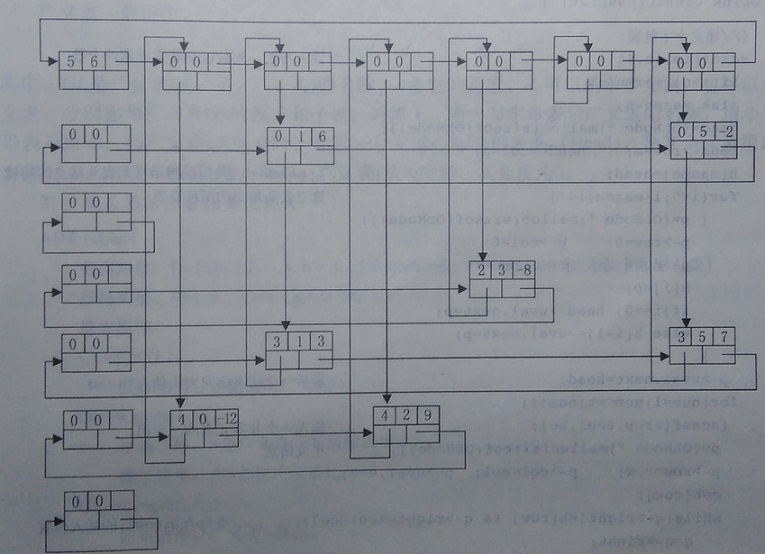

# 稀疏矩阵的压缩-十字链表
利用三元组表表示稀疏矩阵时，若矩阵的运算使非零元素的个数发生变化，就必须对三元组表进行插入、删除，也就是说必须移动三元组表中的元素，由于三元组表是顺序存储结构，所以这些操作将花费大量的时间，十字链表可以克服三元组表的上述缺点。

  在十字链表中，数组的每一行的非零元素结点构成一个带头结点的循环链表，每一列的非零元素结点也构成一个带头结点的循环链表，这种组织方法使同一非零元素结点既处在某一行的链表中，又处在某一列的链表中。因此非零元素结点中设有两个指针域：指针域down指向其同列的下一个非零元素的结点，right域指向其同行的下一个非零元素结点。除这两个域外，结点中还应设有存放该非零元素的行值、列值、元素值的域，设他们分别为row、col和e。十字链表中非零元素结点的结构如下所示：


为了使整个链表中的结点结构一致，我们规定行（列）循环链表的表头结点和表中非零元素的结点一样，也设5个域，并且均置表头结点的行域和列域为零。

由于行表头结点不使用down域，而列表头结点不使用right域，因此，第i行的行表头结点和第i列的列表头结点可以合用一个结点，称为行列表头结点。

由于行表头结点的数据域没有意义的，而且我们希望将行列表头结点组织在一个循环链表中，因此，使用C语言中共用体的概念，将这个域作为指针域，将各行列表头链接起来。

我们为整个十字链表再设一个总表头结点，其row域和col域的值分别是稀疏矩阵的行数和列数，行列指针无意义，用指针域（非零元素结点的元素值域，行列表头结点相链的指针域）指向第一个列表头结点。设head为指向总表头结点的指针，因此，只要给定head指针值，便可取得稀疏矩阵的全部信息了。



## 十字链表的结构类型说明：
```cpp
typedef  int ElemType;
typedef struct OLNode{
	int row, col;
	union 
	{
		struct OLNode *next;	//表头结点使用next域
		ElemType e;				//表中元素结点使用e域
	}uval;
	struct OLNode *down, *right;
}OLNode,*OLink;
```
建立十字链表的算法分为两步：
- 建立表头结点的循环链表。读入矩阵的行数、列数和非零元素的个数。因为行、列链表共享同一组表头结点，所以表头结点的个数应是行数、列数中的较大者。建立整个十字链表的头结点*head以及所有行、列链表的头结点，将头结点通过next域链接成循环链表。初始时每一行、列链表都是空的循环链表。

- 依次读入非零元素的三元组表（row，col，e），生成一个结点*p，然后将其插入到第row行的行链表的正确位置上，以及第col列的列链表的正确位置上。*p的正确位置应为：在行链表上，首先查找到第row行的头结点，然后沿着结点的right域找到第一个列号大于col的结点*（q->right）,而*（q->right）即为*p及结点的后继，*q即为*p结点的前驱，*p应插入到*q结点之后。如果行链表上所有结点的列号均小于col，则*p应插入到行链表的表尾。查找第col列的列链表的正确插入位置与此类似。

## 代码
```cpp
#include<iostream>
using namespace std;
#define  max    100
typedef  int ElemType;
typedef struct OLNode{
	int row, col;
	union 
	{
		struct OLNode *next;	//表头结点使用next域
		ElemType e;				//表中元素结点使用e域
	}uval;
	struct OLNode *down, *right;
}OLNode,*OLink;
OLink CreateCrossList() {		//建立十字链表
	int m, n, t,row,col,e, maxmn;
	OLink h[max],p,q;
	cout << "请输入行数、列数以及非零元素的个数" << endl;
	cin >> m >> n >> t;
	if (m > n) maxmn = m;
	else maxmn = n;
	OLink head = (OLNode*)malloc(sizeof(OLNode));
	head->row = m;
	head->col = n;
	h[maxmn] = head;		//h[maxmn+1]为一组指示行列表头结点的指针
	for (int i = 0; i < maxmn;i++) {	//建立表头结点的循环链表	
	    p= (OLNode*)malloc(sizeof(OLNode));
		p->row = 0; p->col = 0;
		p->down = p; p->right = p;
		h[i] = p;
		if (i == 0) head->uval.next = p;
		else h[i - 1]->uval.next = p;
	}
	p->uval.next = head;		//最后一个结点指向表头结点*head
	for (int num = 1; num <= t;num++) {
		cout << "请输入一个非零元素的三元组" << endl;
		cin >> row >> col >> e;
		p= (OLNode*)malloc(sizeof(OLNode));  //生成结点
		p->row = row;
		p->col = col;
		p->uval.e = e;
		q = h[row];
		while (q->right!=h[row] && q->right->col<col) {	//查*p在第row行的插入位置
			q = q->right;
		}
		p->right = q->right; q->right = p;  //将*p插入到第row行的循环链表中
		q = h[col];
		while (q->down != h[col] && q->down->row < row) {//查*p在第col列的插入位置
 
			q = q->down;
		}
		p->down = q->down; q->down = p;  //将*p插入到第col列的循环链表中
	}
	return head;
}
void print(OLink head) {
	OLink p = head->uval.next;
	int m = 0,n = 0;
	while (m != head->row) {
		p = p->right;
		while (n != head->col) {
			if (m == p->row && n == p->col && p->uval.e!=NULL) {
				cout << p->uval.e << " ";
				p = p->right;
			}
			else {
				cout << "0 ";
			}
			n++;
		}
		n = 0;
		m++;
		p = p->uval.next;
		cout << endl;
	}
}
void main() {
	OLink list;
	list = CreateCrossList();
	cout << "链表内容为:" << endl;
	print(list);
	system("pause");
}
```

