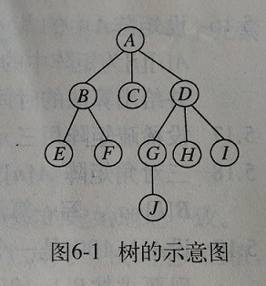
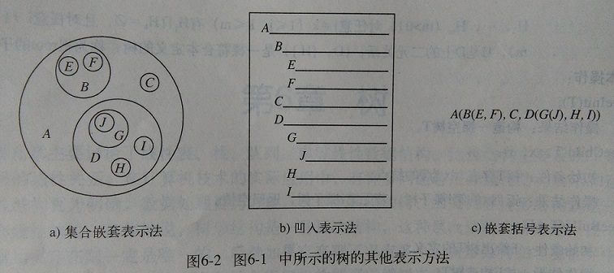
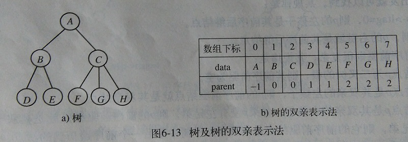
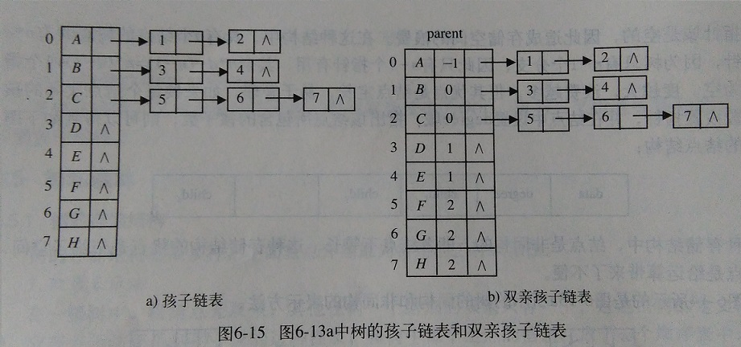
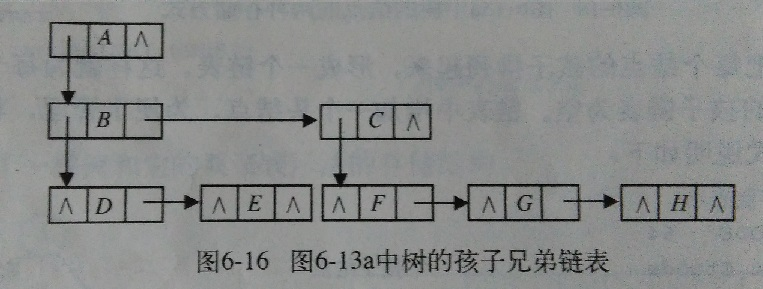

# 树
## 定义
树是由n个结点构成的有限集合T。如果结点为零，则称为空树。否则，任何一个非空树满足以下两个条件：
- 有且只有一个特定的称为根的结点。
- 除根结点以外的其它结点被分为m个互不相交的有限集合T1，T2，T3，, , , , Tm，其中每个集合又是一棵树，并称为根的子树。

## 树的术语：
- 结点：它包含数据项及指向其它结点的分支。
- 结点的度：结点所拥有的子树的个数。
- 叶结点：树中度为0的结点，又称终端结点。
- 非终端结点：度不为零的结点。
- 孩子：一个结点的直接后继被称为该结点的孩子。
- 双亲：一个结点的直接前驱结点被称为该结点的双亲结点。
- 兄弟：同一双亲结点的孩子结点互称为兄弟。
- 祖先：从根结点到该结点所经分支上的所有结点。
- 子孙：以某一结点为根的子树中任一结点。
- 层次：将根结点的层次设为1，其孩子结点层次为2，以此类推。
- 树的高度：树中结点的最大层次。
- 有序树和无序树：如果树中结点的各子树从左到右是有次序的（不能互换），则称该树为有序树，否则称为无序树。
- 森林：m棵互不相交的树的集合。删除一棵树的结点就会得到一个森林，反之，若给森林增加一个统一的根结点，森林就变成一棵树。

## 树的表示法：


## 树的存储结构：
### 1.双亲表示法

在一棵树中，根结点无双亲，其它任何结点的双亲只有一个，这是由树的定义决定的。双亲表示法正是利用了树的这种特性，将树中每个结点的信息存放在一个书序表中，结点的信息包含元素数据值data和结点双亲在表中的位置parent，其形式说明如下：
```cpp
#define MAX_NODE 64		//用户定义最大结点数
typedef char ElmeType;
typedef struct {       //树的双亲表示法存储表示
	ElmeType data;		//数据域
	int parent;			//双亲指示域
}Ptnode;

typedef struct {
	Ptnode nodes[MAX_NODE];
	int n;				//树中的结点个数
}Ptree;
```

### 2.孩子表示法
把每个结点的孩子排列起来，形成一个链表，这样就为每个结点建立一个孩子链表。叶子结点的孩子链表为空。
```cpp
#define MAX_NODE 64	
typedef char ElemType;
typedef struct Ctnode {	//孩子结点
	int child;
	struct Ctnode *next;
}*childlink;
typedef struct {
	ElemType data;
	childlink firstchild;
}CTBox;
CTBox nodes[MAX_NODE];
```


### 3.孩子兄弟表示法
这种方法也被称为二叉树表示法，即用二叉链表作为树的存储结构。链表中结点的两个链域分别指向该结点的第一个孩子结点和下一个兄弟结点，两个链域分别命名为firstchild和nextsibling。其说明如下：
```cpp
typedef char ElemType;
typedef struct CSNode {
	ElemType   data;
	struct CSNode *firstchild, *nextsibling;
}CSNode,*CSTree;
```


## 代码

```cpp
#include<iostream>
using namespace std;
#define MAX_NODE 64		//用户定义最大结点数
typedef char ElemType;
typedef struct {       //树的双亲表示法存储表示
	ElemType data;		//数据域
	int parent;			//双亲指示域
}Ptnode;
typedef struct {
	Ptnode nodes[MAX_NODE];
	int n;				//树中的结点个数
}Ptree;
void TreeInit(Ptree *T) {	//初始化
	T->nodes[MAX_NODE];
	T->n = 0;
}
void TreeChild(Ptree *T, ElemType x) {	//求子树数量
	int num=0,flag=0;
	for (int i = 0; i < T->n;i++) {
		if (T->nodes[i].data == x) {
			num = i;
			break;
		 }
	}
	for (int i = 0; i < T->n; i++) {
		if (T->nodes[i].parent == num) {
			flag++;
		}
	}
	cout << "子树的数量为:" << flag << endl;
}
void TreeBuild(Ptree *T) {			//构造非空树
	//树：A(B(D,E),C(F,G,H))
	T->n = 8;
	T->nodes[0].data = 'A';
	T->nodes[0].parent = -1;
	T->nodes[1].data = 'B';
	T->nodes[1].parent = 0;
	T->nodes[2].data = 'C';
	T->nodes[2].parent = 0;
	T->nodes[3].data = 'D';
	T->nodes[3].parent = 1;
	T->nodes[4].data = 'E';
	T->nodes[4].parent = 1;
	T->nodes[5].data = 'F';
	T->nodes[5].parent = 2;
	T->nodes[6].data = 'G';
	T->nodes[6].parent = 2;
	T->nodes[7].data = 'H';
	T->nodes[7].parent = 2;
}
void TreeClear(Ptree *T){			//清空树
	T->n = 0;
	cout << "清空完成！" << endl;
}
void TreeRoot(Ptree *T){			//求树的根结点
	if (T->n == 0) {
		cout << "空树没有根结点" << endl;
	}
	else {
		cout << "根结点为：" << T->nodes[0].data << endl;
	}
}
void Traverse(Ptree *T) {			//遍历树（广度方向遍历） 层次非递归
	if (T->n == 0) {
		cout << "空树" << endl;
	}
	else {
		cout << "广度优先遍历结果为" << T->nodes[0].data;
		for (int i = 0; i < T->n; i++) {
			for (int j = i + 1; j < T->n; j++) {
				if (T->nodes[j].parent == i) {
					cout << T->nodes[j].data;
				}
			}
		}
		cout << endl;
	}
}
void TreeDept(Ptree *T) {			//求层次
	int height, max = 0, p;
	for (int i = 0; i < T->n; i++) {
		height = 1;
		p = T->nodes[i].parent;
		while (p != -1) {
			p = T->nodes[p].parent;
			height++;
		}
		if (height > max) {
			max = height;
		}
	}
	cout << "层次为：" << max << endl;
}
void TreeParent(Ptree *T,ElemType x) {		//求双亲
	for (int i = 0; i < T->n; i++) {
		if (T->nodes[i].data == x) {
			if (T->nodes[i].parent == -1) {
				cout << "根结点无双亲" << endl;
			}
			else {
				cout << x <<"双亲结点为:" << T->nodes[T->nodes[i].parent].data << endl;
			}
			break;
		}
	}
}
void TreeRightBrother(Ptree *T, ElemType x) {	//求右兄弟结点
	int num = 0;
	for (int i = 0; i < T->n; i++) {
		if (T->nodes[i].data == x) {
			num = i;
			break;
		}
	}
	if (T->nodes[num].parent == T->nodes[num + 1].parent) {
		cout << x << "右兄弟结点为：" << T->nodes[num + 1].data << endl;
	}
	else {
		cout << "无右兄弟结点" << endl;
	}
}
void TreeLeftBrother(Ptree *T, ElemType x) {	//求左兄弟结点
	int num = 0;
	for (int i = 0; i < T->n; i++) {
		if (T->nodes[i].data == x) {
			num = i;
			break;
		}
	}
	if (T->nodes[num].parent == T->nodes[num - 1].parent) {
		cout << "左兄弟结点为：" << T->nodes[num - 1].data << endl;
	}
	else {
		cout << "无左兄弟结点" << endl;
	}
}
void main() {
	Ptree tree;
    TreeInit(&tree);
	TreeBuild(&tree);
	TreeDept(&tree);
	Traverse(&tree);
	TreeRoot(&tree);
	TreeParent(&tree, 'A');
	TreeParent(&tree, 'E');
	TreeLeftBrother(&tree, 'B');
	TreeLeftBrother(&tree, 'C');
	TreeRightBrother(&tree, 'H');
	TreeRightBrother(&tree, 'G');
	TreeClear(&tree);
	Traverse(&tree);
	system("pause");
}
```