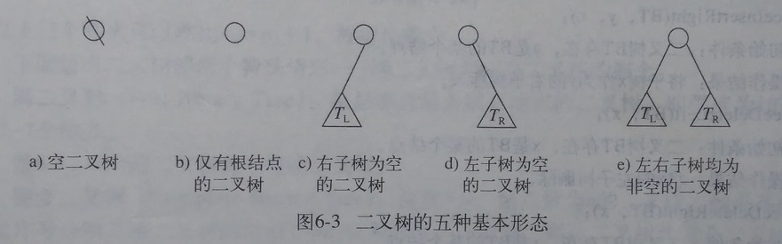
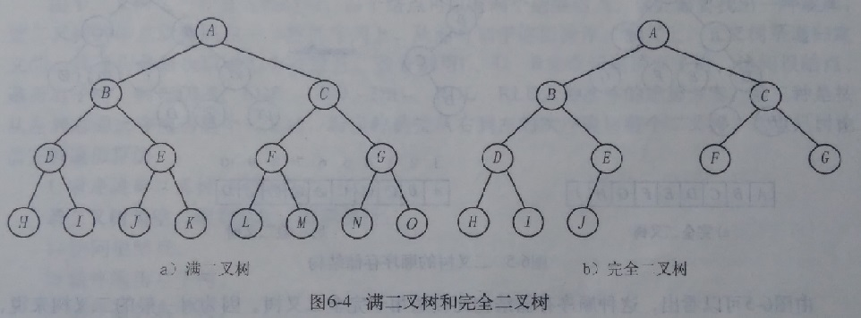
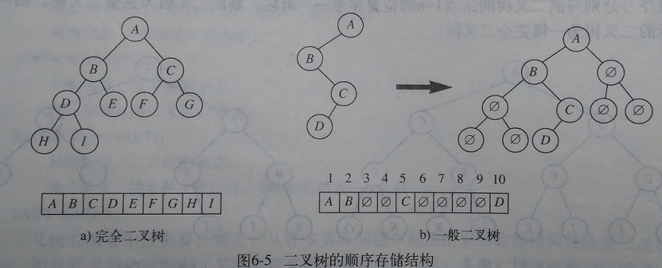
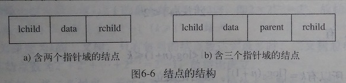
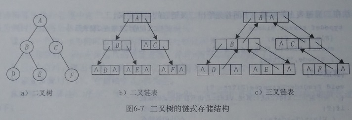

# 二叉树
## 二叉树的概念
二叉树是另一种重要的树形结构，其递归形式的定义为：

二叉树是n个结点的有限集合，该集合或者为空，或者是由一个特定的称之为根的结点和两个互不相交的称之为左子树和右子树的二叉树组成。

    二叉树的特点是每个结点最多有两个孩子，分别称为该结点的左孩子和右孩子。也就是说，二叉树中不存在度大于2的结点，并且二叉树的子树有左右之分，其子树的次序不能颠倒，即使只有一颗子树，也必须说明是左子树还是右子树。

## 二叉树的五种基本形态：

## 二叉树的特殊情形-满二叉树和完全二叉树
满二叉树：每层都有最大数目结点的二叉树，即深度为k的满二叉树有2k-1个结点。

完全二叉树：深度为k，结点数为n的二叉树，如果其结点1~n的位置上序号分别与满二叉树地 结点1~n的位置序号一一对应，则此二叉树为完全二叉树。

## 二叉树的性质
- 一个非空二叉树的第i层上至多有2i-1个结点（i>0）。
- 深度为K的二叉树至多有2k-1个结点（k>1）。
- 在任何一棵二叉树中，若叶子数为n0，度为2的结点个数为n2，n0=n2+1。
- 具有n个结点的完全二叉树的深度为Log2(n+1)。
- 如果对一棵有n个结点的完全二叉树按层次自上而下（每层从左而右）对结点从1~n进行编号，则对任意一个结点i(1≤i≤n)，有

  ①若i=1，则结点i为根，无双亲；若i>1，则结点i的双亲结点的边号是i/2.

  ②若2i≤n，则i的左孩子的编号是2i，否则i无左孩子。

  ③若2i+1≤n，则i的右孩子编号是2i+1，否则i无右孩子。

## 二叉树的存储结构
### 1）顺序存储结构

顺序存储结构是一组地址连续的存储单元一次自上而下、从左至右地存储二叉树中的各个结点。对于完全二叉树，将完全二叉树上编号为i的结点存储在如上定义的一维数组中下标为i的分量中，如图6-5a所示，对于一般的二叉树，为了能够很容易地找到某一结点的双亲、孩子、兄弟等具有一定关系的结点，则需要将二叉树先扩展为完全二叉树，新增加的结点全部记为“ø“，表示该结点不存在。然后将其每个结点存储在一维数组的相应分量中。



这种书序存储结构比较适用于完全二叉树。因为对于一般的二叉树来说，在最坏的情况下容易造成存储空间的极大浪费。

### 2）链式存储结构

每个结点中除存储元素本身的信息外，在设置两个指针域lchild和rchild，分别指向该结点的左孩子和右孩子，当结点的某个孩子为空时，则相应的指针为空指针。若要在二叉树中经常寻找结点的双亲，每个结点还可以增加一个指向双亲的指针域parent。


 利用这两种结点结构所构成的二叉树的存储结构分别称为二叉链表和三叉链表。结点及链表存储示例如下：




## 遍历
三种遍历的本质上是一样的，每个结点都会被经过三次，只不过是结点输出的时间点不同。

### 前序遍历：
```cpp
void BinTreefrontTraverse(BiTree T) {		//递归前序遍历
	if (T) {
		cout << T->data << " ";
		BinTreefrontTraverse(T->lchild);
		BinTreefrontTraverse(T->rchild);
	}
}
```
### 中序遍历：
```cpp
void BinTreeMidTraverse(BiTree T) {		//递归中序遍历
	if (T) {
		BinTreeMidTraverse(T->lchild);
		cout << T->data << " ";
		BinTreeMidTraverse(T->rchild);
	}
}
```
### 后序遍历：
```cpp
void BinTreeBackTraverse(BiTree T) {	//递归后序遍历
	if (T) {
		BinTreeBackTraverse(T->lchild);
		BinTreeBackTraverse(T->rchild);
		cout << T->data << " ";
	}
}
```
### 非递归前序遍历
```cpp
void BinTreefrontTraverseUn(BiTree T) {		//非递归前序遍历
	stack<BiTree, vector<BiTree>> s;
	while (T || !s.empty()) {
		if (T) {
			cout << T->data << " ";
			s.push(T);
			T = T->lchild;
		}
		else {
			T = s.top();
			s.pop();
			T = T->rchild;
		}
	}
}
```

### 非递归中序遍历
```cpp
void BinTreeMidTraverseUn(BiTree T) {		//非递归中序遍历
	stack<BiTree, vector<BiTree>> s;
	while (T || !s.empty()) {
		if (T) {
			s.push(T);
			T = T->lchild;
		}
		else {
			T = s.top();
			s.pop();
			cout << T->data << " ";
			T = T->rchild;
		}
	}
}
```
### 非递归后序遍历
```cpp
void BinTreeBackTraverseUn(BiTree T) {	//非递归后序遍历
	stack<BiTree, vector<BiTree>> s;
	BiTree cur, pre=NULL;
	s.push(T);
	while (!s.empty()) {
		cur = s.top();
		if ((cur->lchild == NULL && cur->rchild == NULL) || (pre != NULL && (pre == cur->lchild || pre == cur->rchild))) {
			cout << cur->data << " ";
			s.pop();
			pre = cur;
		}
		else {
			if (cur->rchild != NULL) s.push(cur->rchild);
			if (cur->lchild != NULL) s.push(cur->lchild);
		}
	}
}

```

### 求深度：
```cpp
int BinTreeDepth(BiTree T) {
	int i, j;
	if (!T) {
		return 0;
	}
	else
	{
		i = BinTreeDepth(T->lchild);
		j = BinTreeDepth(T->rchild);
	}
	return i > j ? i + 1 : j + 1;
}

```
## 代码
```cpp
#include<iostream>
#include<vector>
#include<stack>
using namespace std;
typedef char ElemType;
typedef struct BiNode {
	ElemType data;
	struct BiNode *lchild, *rchild;
}BiNode, *BiTree;
void BinTreeInit(BiTree &T);
void BinTreeCreateFront(BiTree &T);	//前序序列构造二叉树
void BinTreeCreateMid(BiTree &T); //中序序列构造二叉树
void BinTreeCreateBack(BiTree &T);	//后序序列构造二叉树
void BinTreeRoot(BiTree T);     	//求根结点
void BinTreeParent(BiTree T, BiTree p, ElemType x, ElemType &a);		//求结点的双亲
void BinLeftChild(BiTree T, ElemType x);	//求结点的左孩子
void BinRightChild(BiTree T, ElemType x);		//求结点的右孩子
void BinTreeInsertLeft(BiTree &T, ElemType y, ElemType x);		//在Y处以左子树插入  Y的左子树作为x的左子树
void BinTreeInsertRight(BiTree &T, ElemType y, ElemType x);//在Y处以右子树插入
void BinTreeDeleteLeft(BiTree &T);	//删除左子树
void BinTreeDeleteRight(BiTree &T);		//删除右子树
void BinTreeClear(BiTree &T);		//清空  后序序列删除如果 先删除结点的话，就无法访问其子树
void BinTreefrontTraverse(BiTree T);	//递归前序遍历
void BinTreeMidTraverse(BiTree T);	//递归中序遍历
void BinTreeBackTraverse(BiTree T);	//递归后序遍历
void BinTreefrontTraverseUn(BiTree T);	//非递归前序遍历
void BinTreeMidTraverseUn(BiTree T);		//非递归中序遍历
void BinTreeBackTraverseUn(BiTree T);	//非递归后序遍历
void BinTreeEmpty(BiTree T);	//判空
int BinTreeDepth(BiTree T);    //求深度
void print() {
	cout << "************************************************************************" << endl;
	cout << "*   1 前序构造二叉树    2 求深度                3 求右孩子             *" << endl;
	cout << "*   4 求根结点          5 求双亲结点            6 求左孩子             *" << endl;
	cout << "*   7 以左子树插入      8 以右子树插入          9 删除左子树           *" << endl;
	cout << "*  10 删除右子树       11 清空                 12 递归前序遍历         *" << endl;
	cout << "*  13 递归中序遍历     14 递归后序遍历         15 非递归前序遍历       *" << endl;
	cout << "*  16 非递归中序遍历   17 非递归后序遍历       18 清屏                 *" << endl;
	cout << "*  19 退出             20 判空                                         *" << endl;
	cout << "************************************************************************" << endl;
}
void main() {
	BiTree tree, p=NULL; 
	ElemType y, x,a;
	BinTreeInit(tree);
	int num;
	print();
	while (1) {
		cin >> num;
		switch (num)
		{
		case 1:BinTreeCreateFront(tree);cout << "前序序列构造二叉树完成" << endl; break;
		case 2:cout << "深度为：" << BinTreeDepth(tree) << endl; break;
		case 3:cout << "请输入结点的值：" << endl;
			cin >> x;
			BinRightChild(tree, x); break;
		case 4:BinTreeRoot(tree); break;
		case 5:a = 0;
			cout << "请输入结点的值：" << endl;
			cin >> x; 
			BinTreeParent(tree,p,x,a);
			cout << "双亲结点为：" << a << endl;
			break;
		case 6:
			cout << "请输入结点的值：" << endl;
			cin >> x; 
			BinLeftChild(tree, x);
			break;
		case 7:
			cout << "请输入被插入结点值和插入结点值" << endl;
			cin >> y >> x;
			BinTreeInsertLeft(tree, y, x); break;
		case 8:
			cout << "请输入被插入结点值和插入结点值" << endl;
			cin >> y >> x;
			BinTreeInsertRight(tree, y, x); break;
		case 9:BinTreeDeleteLeft(tree); break;
		case 10:BinTreeDeleteRight(tree); break;
		case 11:BinTreeClear(tree); cout << "删除成功！" << endl; break;
		case 12:cout << "递归前序遍历:"; BinTreefrontTraverse(tree); cout << endl; break;
		case 13:cout << "递归中序遍历:"; BinTreeMidTraverse(tree); cout << endl; break;
		case 14:cout << "递归后序遍历:"; BinTreeBackTraverse(tree); cout << endl; break;
		case 15:cout << "非递归前序遍历:"; BinTreefrontTraverseUn(tree); cout << endl; break;
		case 16:cout << "非递归中序遍历:"; BinTreeMidTraverseUn(tree); cout << endl; break;
		case 17:cout << "非递归后序遍历:"; BinTreeBackTraverseUn(tree); cout << endl; break;
		case 18:system("cls");print(); break;
		case 19:exit(0); break;
		case 20:BinTreeEmpty(tree); break;
		default:cout << "输入错误请重新输入" << endl;break;
		}
	}
}
void BinTreeInit(BiTree &T) {		//构造空的二叉树
	T = NULL;
}
void BinTreeCreateFront(BiTree &T) {	//前序序列构造二叉树
	ElemType ch;
	cin >> ch;
	if (ch == '#') {
		T = NULL;
	}
	else {
		T = (BiNode *)malloc(sizeof(BiNode));
		T->data = ch;
		BinTreeCreateFront(T->lchild);
		BinTreeCreateFront(T->rchild);
	}
}
void BinTreeCreateMid(BiTree &T) {	//中序序列构造二叉树
	ElemType ch;
	cin >> ch;
	if (ch == '#') {
		T = NULL;
	}
	else {
		T = (BiNode *)malloc(sizeof(BiNode));
		BinTreeCreateMid(T->lchild);
		T->data = ch;
		BinTreeCreateMid(T->rchild);
	}
}
void BinTreeCreateBack(BiTree &T) {	//后序序列构造二叉树
	ElemType ch;
	cin >> ch;
	if (ch == '#') {
		T = NULL;
	}
	else {
		T = (BiNode *)malloc(sizeof(BiNode));
		BinTreeCreateBack(T->lchild);
		BinTreeCreateBack(T->rchild);
		T->data = ch;
	}
}
void BinTreeRoot(BiTree T) {		//求根结点
	if (T) {
		cout << "根节点是：   " << T->data << endl;
	}
	else {
		cout << "空树没有根节点"<< endl;
	}
	
}
void BinTreeParent(BiTree T, BiTree pre, ElemType x,ElemType &a) {		//求结点的双亲
	if (!T) {
		return;
	}
	if (T->data == x) {
		a = pre->data;
		return;
	}
	if (!a) {
		BinTreeParent(T->lchild, T, x, a);
		BinTreeParent(T->rchild, T, x, a);
	}
}
void BinLeftChild(BiTree T, ElemType x) {		//求结点的左孩子
	if (T->data != x) {
		BinLeftChild(T->lchild, x);
		BinLeftChild(T->rchild, x);
	}
	else if (T->lchild != NULL) {
		cout << x << "的左孩子是：" << T->lchild->data << endl;
	}
}
void BinRightChild(BiTree T, ElemType x) {		//求结点的右孩子
	if (T->data != x) {
		BinRightChild(T->lchild, x);
		BinRightChild(T->rchild, x);
	}
	else if (T->rchild != NULL) {
		cout << x << "的左孩子是：" << T->rchild->data << endl;
	}
}
void BinTreeInsertLeft(BiTree &T, ElemType y, ElemType x) {		//在Y处以左子树插入  Y的左子树作为x的左子树
	if (T && T->data != y) {
		BinTreeInsertLeft(T->lchild, y, x);
		BinTreeInsertLeft(T->rchild, y, x);
	}
	else {
		BiTree P = (BiNode*)malloc(sizeof(BiNode));
		P->data = x;
		P->lchild = T->lchild;
		P->rchild = NULL;
		T->lchild = P;
		cout << "左子树插入成功" << endl;
	}
}
void BinTreeInsertRight(BiTree &T, ElemType y, ElemType x) {//在Y处以右子树插入
	if (T&&T->data != y) {
		BinTreeInsertRight(T->lchild, y, x);
		BinTreeInsertRight(T->rchild, y, x);
	}
	else {
		BiTree P = (BiNode*)malloc(sizeof(BiNode));
		P->data = x;
		P->rchild = T->rchild;
		P->lchild = NULL;
		T->rchild = P;
		cout << "右子树插入成功" << endl;
	}
}
void BinTreeDeleteLeft(BiTree &T) {		//删除左子树
	if (T) {
		BinTreeClear(T->lchild);
	}
	cout << "删除左子树成功！" << endl;
}
void BinTreeDeleteRight(BiTree &T) {		//删除右子树
	if (T) {
		BinTreeClear(T->rchild);
	}
	cout << "删除左子树成功！" << endl;
}
void BinTreeClear(BiTree &T) {		//清空  后序序列删除如果 先删除结点的话，就无法访问其子树
	if (T) {
		BinTreeClear(T->lchild);
		BinTreeClear(T->rchild);
		free(T);
		T = NULL;
	}
}
void BinTreefrontTraverse(BiTree T) {		//递归前序遍历
	if (T) {
		cout << T->data << " ";
		BinTreefrontTraverse(T->lchild);
		BinTreefrontTraverse(T->rchild);
	}
}
void BinTreeMidTraverse(BiTree T) {		//递归中序遍历
	if (T) {
		BinTreeMidTraverse(T->lchild);
		cout << T->data << " ";
		BinTreeMidTraverse(T->rchild);
	}
}
void BinTreeBackTraverse(BiTree T) {	//递归后序遍历
	if (T) {
		BinTreeBackTraverse(T->lchild);
		BinTreeBackTraverse(T->rchild);
		cout << T->data << " ";
	}
}
void BinTreefrontTraverseUn(BiTree T) {		//非递归前序遍历
	stack<BiTree, vector<BiTree>> s;
	while (T || !s.empty()) {
		if (T) {
			cout << T->data << " ";
			s.push(T);
			T = T->lchild;
		}
		else {
			T = s.top();
			s.pop();
			T = T->rchild;
		}
	}
}
void BinTreeMidTraverseUn(BiTree T) {		//非递归中序遍历
	stack<BiTree, vector<BiTree>> s;
	while (T || !s.empty()) {
		if (T) {
			s.push(T);
			T = T->lchild;
		}
		else {
			T = s.top();
			s.pop();
			cout << T->data << " ";
			T = T->rchild;
		}
	}
}
void BinTreeBackTraverseUn(BiTree T) {	//非递归后序遍历
	stack<BiTree, vector<BiTree>> s;
	BiTree cur, pre=NULL;
	s.push(T);
	while (!s.empty()) {
		cur = s.top();
		if ((cur->lchild == NULL && cur->rchild == NULL) || (pre != NULL && (pre == cur->lchild || pre == cur->rchild))) {
			cout << cur->data << " ";
			s.pop();
			pre = cur;
		}
		else {
			if (cur->rchild != NULL) s.push(cur->rchild);
			if (cur->lchild != NULL) s.push(cur->lchild);
		}
	}
}
void BinTreeEmpty(BiTree T) {
	if (T) {
		cout << "非空树" << endl;
	}
	else {
		cout << "空树" << endl;
	}
}
int BinTreeDepth(BiTree T) {
	int i, j;
	if (!T) {
		return 0;
	}
	else
	{
		i = BinTreeDepth(T->lchild);
		j = BinTreeDepth(T->rchild);
	}
	return i > j ? i + 1 : j + 1;
}
```