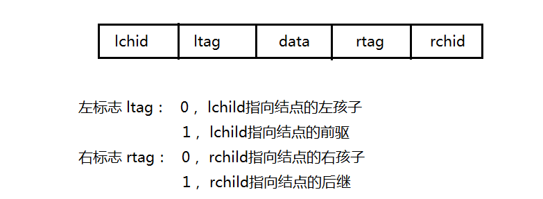

# 线索二叉树

以这种结点构成的二叉链表作为二叉树的存储结构，称为线索链表，其中指向结点前驱和后继的指针，称为线索；加上线索的二叉树，称为线索二叉树，以某种次序遍历二叉树使其变为线索二叉树的过程，称为线索化。

## 代码
```cpp
#include<iostream>
using namespace std;
typedef char ElemType;
enum flag{	zero, one};  // zero 代表否 one代表真
typedef struct BiThrNode {
	ElemType data;
	struct BiThrNode *lchild, *rchild;
	flag ltag : 2;  //分别两个字节
	flag rtag : 2;
}BiThrNode,*BiThrTree;
void CreateBiTree(BiThrTree  &T) {  //前序序列构造二叉树
	ElemType ch;
	cin >> ch;
	if (ch == '#') {
		T = NULL;
	}
	else {
		T = (BiThrTree)malloc(sizeof(BiThrNode));
		T->data = ch;
		CreateBiTree(T->lchild);
		if (T->lchild) {
			T->ltag = zero;
		}
		CreateBiTree(T->rchild);
		if (T->rchild) {
			T->rtag = zero;
		}
	}
}
BiThrTree pre = NULL;
void inThreat(BiThrTree p) { //对二叉树进行中序线索化
	if (p) {
		inThreat(p->lchild);
		if (p->lchild == NULL) {
			p->ltag = one;
			p->lchild = pre;
		}
		if (pre->rchild == NULL) {
			pre->rtag = one;
			pre->rchild = p;
		}
		pre = p;
		inThreat(p->rchild);
	}
}
void inOrderThreat(BiThrTree &T,BiThrTree p) {  //连接含有null的结点形成一个闭环
	T = (BiThrTree)malloc(sizeof(BiThrNode));
	T->ltag = zero;
	T->rtag = one;
	T->rchild = T;
	if (p) {
		T->lchild = p;
		pre = T;
		inThreat(p);
		pre->rtag = one;
		pre->rchild = T;
		T->rchild = pre;
	}
	else {
		T->lchild = T;
	}
}
void inOrderThreatTraverse(BiThrTree T) {  //中序遍历二叉树
	BiThrTree p = T->lchild;
	while (p!=T) {
		while (p->ltag == zero) {
			p = p->lchild;
		}
		cout << p->data << " ";
		while (p->rtag==one && p->rchild !=T) {
			p = p->rchild;
			cout << p->data << " ";
		}
		p = p->rchild;
	}
}
void main() {
	BiThrTree H,T;
	cout << "请输入前序序列构造二叉树" << endl;
	CreateBiTree(T);
	inOrderThreat(H, T);
	cout << "中序遍历结果为：" << endl;
	inOrderThreatTraverse(H);
	system("pause");
}
```