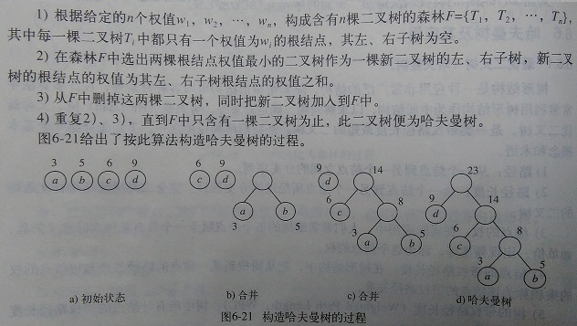

# 哈夫曼树
哈夫曼树，又称最优二叉树，是一类带权路径长度最短的二叉树。

（1）路径：从一个结点到另一个结点之间的分支序列。

（2）路径长度：从一个结点到另一个结点所经过的分支数目。完全二叉树是路径长度最短的二叉树。

（3）结点的权：在实际应用中，人们常常给树的每个结点赋予一个具有某种实际意义的数，如单价、出现频率等，称为这个结点的权。

（4）结点的带权路径长度：在树形结构中，把从树根到某一结点的路径长度与该结点的权的乘积。

（5）树的带权路径长度：树中所有叶结点的带权路径长度之和。



## 代码
```cpp
#include<iostream>
using namespace std;
#define n 4
typedef struct {    //哈夫曼结点结构
	char data;
	 int weight;
	 int parent, lchild, rchild;
}hufmTree;
typedef struct {
	int start;
	char ch;
	char bits[n];
}codetype;
int minNum(hufmTree t[],int i) {  //求权值最小的结点
	int m;
    int k = 10000;		
	for (int j = 1; j < i; j++) {
		if (t[j].weight < k && t[j].parent == 0) {
			k = t[j].weight;
			m = j;
		}
	}
	t[m].parent = 1;
	return m;
}
void selectNum(hufmTree t[], int i,int &p1 ,int &p2) {    //求权值最小的两个结点
	int x;
	p1 = minNum(t, i);
	p2 = minNum(t, i);
	if (p1 > p2) {
		x = p1;
		p1 = p2;
		p2 = x;
	}
}
void createhufman(hufmTree t[],int x) {  //n为初始森林的结点数
	if (x <= 1) {
		cout << "结点数不能小于2";
		return;
	}
	int  m = x * 2;
	for (int i = 1; i < m; i++) {    //进行初始化  下标0的单元不用
		t[i].parent = 0;
		t[i].lchild = 0;
		t[i].rchild = 0;
		t[i].weight = 0;
	}
	for (int i = 1; i <= x; i++) {   //读入叶子结点的权值
		cin >> t[i].data>> t[i].weight;
	}
	for (int i = n + 1; i < m; i++) {  //将n个叶子结点与n-1个结点进行合并形成哈夫曼树
		int p1, p2;
		selectNum(t, i, p1, p2);
		t[p1].parent = i;
		t[p2].parent = i;
		t[i].lchild = p1;
		t[i].rchild = p2;
		t[i].weight = t[p1].weight + t[p2].weight;
	}
}
void hufmCoding(hufmTree t[],int x,codetype cd[]) {
	int c,p;
	codetype flag; //缓冲变量
	for (int i = 1; i <= x; i++) {
		flag.ch = t[i].data;
		flag.start = x;
		c = i;
		p = t[i].parent;
		while (p != 0) {
			flag.start--;
			if (t[p].lchild == c) {
				flag.bits[flag.start] = '0';
			}
			else {
				flag.bits[flag.start] = '1';
			}
			c = p;
			p = t[p].parent;
		}
		cd[i] = flag;
	}
}
void printhufm(hufmTree t[]) {
	int y = 1;
	cout << "字符   权值   左孩子   右孩子   父亲结点" << endl;
	while (t[y].parent != 0) {
		cout << t[y] .data<<"      "<< t[y].weight << "      "<< t[y].lchild<<"      "<< t[y].rchild<<"      "<< t[y].parent<<endl;
		y++;
	}
	cout << t[y].data << "      " << t[y].weight << "      " << t[y].lchild << "      " << t[y].rchild << "      " << t[y].parent << endl;
}
void main() {
	hufmTree T[100];
	codetype cd[n];
	cout << "请输入4个结点的字符和权值" << endl;
	createhufman(T,n);
	cout << "哈夫曼编码为：" << endl;
	printhufm(T);
	hufmCoding(T,n, cd);
	for (int i = 1; i <= n; i++) {
		cout << cd[i].ch << " ";
		for (int j = cd[i].start; j < n; j++) {
			cout << cd[i].bits[j] << " ";
		}
		cout << endl;
	}
	system("pause");
}
```