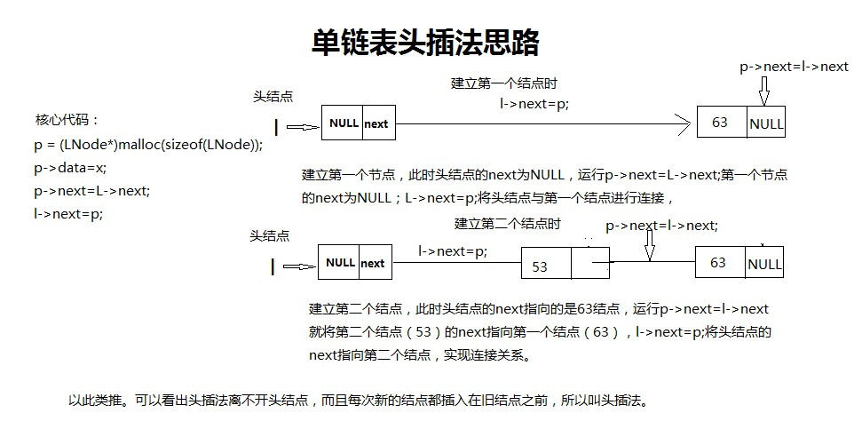

# 链表
## 链表定义
以链式结构存储结构的线性表称为线性链表。

元素本身的信息和其后期信息组成数据元素的存储映像，称为结点;

线性链表有三种：
- 单链表
- 双链表
- 循环链表。
对链表的任何操作都必须从第一个结点开始，第一个结点的地址存放在一个指针变量中，这个指针变量指向第一个结点，
也就是链表最前面的结点，因此这个指针变量常称为头指针。

我们在整个线性链表的第一个结点之前加入一个结点称为头结点。

链表优缺点：
- 缺：失去了顺序存储结构的随机存储特点，在查找等算法中要比顺序存储结构慢。
- 优：插入或删除要比顺序表方便得多。

## 单链表
单链表是最简单的一种链式结构。表中每个元素结点包括两部分：数据域和后继节点的地址域。
地址域：存放数据元素信息的域。
指针域：存放后期地址的域。
因为每个结点中只有一个指向后继的指针，所以就称为单链表。

单链表的实现：头插法和尾插法两种。同时也分带结点和不带结点！
### 头插法

### 尾插法


## 代码
单链表的基本操作：
- Length（L） 返回表L的长度，即表中元素个数
- Prior（L，i） 取位置i的前驱元素
- Next（L，i） 取位置i的后继元素
- Locate（L，x） 这是一个函数，函数值为元素x在L中的位置
- Insert（L，i，x）在表L的位置i处插入元素x，将原占据位置i的元素及后面的元素都向后推一个位置
- Delete（L，p） 从表L中删除位置p处的元素
- Get（L，i） 这是一个函数，函数值为L中位置i处的元素（1≤i≤n）
- Empty(L) 如果表L为空表(长度为0)则返回true，否则返回false
- Clear（L）清除所有元素
- Traverse（L）遍历输出所有元素
- Update（L，i,x）修改元素
- 退出
- 清空命令行！
- CreateT() 头插法
- CreateW1() 尾插法（带头结点）
- CreateW2()尾插法（不带头结点）
```cpp
#include<iostream>
#include<cstdlib>
#include<malloc.h>
using namespace std;
typedef int dataType;
typedef struct Node{
	dataType data=-1;
	struct Node *next;
}LNode,*LinkedList;
//创建链表  头插法
LinkedList linkedListCreateT() {
	int i = 1;
	LinkedList l = (LNode*)malloc(sizeof(LNode));
	if (l == NULL) {
		cout << "创建失败没有足够空间！" << endl;
		return l;
	}
	l->next = NULL;
	while (i != 21) {
		LinkedList p = (LNode*)malloc(sizeof(LNode));
		p->data = i;
		++i;
		p->next = l->next;
		l->next = p;
	}
	cout << "头插法单链表创建成功！" << endl;
	return l;
}
//创建链表  尾插法 带头结点
LinkedList linkedListCreateW1() {
	int i = 1;
	LinkedList r;
	LinkedList l = (LNode*)malloc(sizeof(LNode));
	if (l == NULL) {
		cout << "创建失败没有足够空间！" << endl;
		return l;
	} 
	l->next = NULL;
	r = l;
	while (i != 21) {
		LinkedList p = (LNode*)malloc(sizeof(LNode));
		p->data = i;
		++i;
		p->next = r->next;
		r->next = p;
		r = p;
	}
	cout << "尾插法带头结点单链表创建成功！" << endl;
	return l;
}
//创建链表  尾插法 不带头结点
LinkedList linkedListCreateW2() {
	int i = 1;
	LinkedList r;
	LinkedList l = (LNode*)malloc(sizeof(LNode));
	if (l == NULL) {
		cout << "创建失败没有足够空间！" << endl;
		return l;
	}
	l->next = NULL;
	r = l;
	while (i != 21) {
		LinkedList p = (LNode*)malloc(sizeof(LNode));
		p->data = i;
		++i;
		if (l == NULL) l = p;
		else r->next = p;
		r = p;
	}
	if (r != NULL) r->next = NULL;
	cout << "尾插法不带头结点单链表创建成功！" << endl;
	return l;
}
//表中元素个数
int  linkedListLength(LinkedList l) {
	int i=0;
	LinkedList p;
	if (l->data > 0) {
		p = l;
		while (p!= NULL) {
			++i;
			p = p->next;
		}
	}
	else {
		p = l->next;
		while (p!= NULL) {
			++i;
			p = p->next;
		}
	}
	return i;
}
//函数值为L中位置i处的元素
void linkedListGet(LinkedList l,int i) {
	if (i<1 || i> linkedListLength(l)) cout << "超出链表表长度！请重新输入！" << endl;
	else { 
		int j = 0;
		LinkedList p;
		if (l->data != NULL) {
			p = l;
			while (p->next != NULL && j!= i) {
				++j;
				p = p->next;
			}
		}
		else {
			p = l->next;
			while (p->next != NULL && j!=i) {
				++j;
				p = p->next;
			}
		}
		cout << i << "位置的元素是：" << p->data << endl; 
	}
}
//取位置i的前驱元素
void linkedListPrior(LinkedList l, int i) {
	if (i<1 || i> linkedListLength(l)) cout << "超出顺序表长度！请重新输入！" << endl;
	else if(i == 1) cout<<"首元素没有前驱！"<<endl;
	else {
		int j = 0;
		LinkedList p;
		if (l->data != NULL) {
			p = l;
			while (p->next != NULL && j!=i-1) {
				++j;
				p = p->next;
			}
		}
		else {
			p = l->next;
			while (p->next != NULL && j != i - 1) {
				++j;
				p = p->next;
			}
		}
		cout << "位置：" << i << "的前驱元素为:" << p->data << endl;
	}
}
//取位置i的后继元素
void linkedListNext(LinkedList l, int i) {
	if (i<1 || i> linkedListLength(l)) cout << "超出顺序表长度！" << endl;
	else if (i == linkedListLength(l)) cout<<"尾元素没有后驱！"<<endl;
	else {
		int j = 0;
		LinkedList p;
		if (l->data != NULL) {
			p = l;
			while (p->next != NULL && j != i + 1) {
				++j;
				p = p->next;
			}
		}
		else {
			p = l->next;
			while (p->next != NULL && j != i + 1) {
				++j;
				p = p->next;
			}
		}
		cout << "位置" << i << "的后驱是：" << p->data << endl;
	}
}
//元素x在L中的位置
void linkedListLocate(LinkedList l, dataType x) {
	int i = 0;
	LinkedList p;
	if (l->data != NULL) {
		p = l;
		while (p->next != NULL && p->data != x) {
			++i;
			p = p->next;
		}
	}
	else {
		p = l->next;
		while (p->next != NULL && p->data != x) {
			++i;
			p = p->next;
		}
	}
	if (i <= linkedListLength(l)) cout<<x<<"在表中的位置是："<<i<<endl;
	else cout<<"不在表中"<<endl;
}
//在表L的位置i处插入元素x
LinkedList linkedListInsert(LinkedList l,int i,dataType x) {
	int j = 1;
	LinkedList pri=l,s=l;
	LinkedList p = (LNode*)malloc(sizeof(LNode));
	p->data = x;
	if (l->data > 0) {
		if (i == 1) {
			p->next = l;
			cout << "插入成功！" << endl;
			return p;
		}
		else while (j != i + 1) {
			pri = s;
			s = s->next;
			++j;
		}
		pri->next = p;
		p->next = s;
	}
	else {
		while (j != i + 1) {
			pri = s;
			s = s->next;
			++j;
		}
		pri->next = p;
		p->next = s;
	}
	cout << "插入成功！" << endl;
	return l;
}
//删除位置i处的元素
LinkedList linkedListDelete(LinkedList l,int i) {
	int j = 1;
	LinkedList pri = l, p = l;
	if (i<1 || i> linkedListLength(l)) {
		cout << "超出顺序表长度！" << endl; 
		return l;
	}
	if (l->data > 0) {
		if (i == 1) {
			p = p->next;
			free(pri);
			cout << "删除成功！" << endl;
			return p;
		}
		else while (i != j) {
			pri = p;
			p = p->next;
			++j;
		}
		pri->next = p->next;
		free(p);
	}
	else {
		p = p->next;
		if (i == 1) {
			pri = p;
			p = p->next;
			l->next = p;
			free(pri);
		}
		else {
			while (i != j) {
				pri = p;
				p = p->next;
				++j;
			}
			pri->next = p->next;
			free(p);
		}
	}
	cout << "删除成功！" << endl;
	return l;
}
//表是否为空
void linkedListEmpty(LinkedList l) {
	if (l->next==NULL) {
		cout << "是空表！" << endl;
	}
	else cout << "不是空表！" << endl;
}
//清空表
LinkedList linkedListClear(LinkedList l) {
	LinkedList p,r;
	p = l->next;
	while (p!= NULL) {
		r = p->next;
		free(p);
		p = r;
	}
	l->next=NULL;
	l->data = NULL;
	cout << "清空完成！" << endl;
	return l;
}
//遍历输出所有元素
void linkedListTraverse(LinkedList l) {
	LinkedList p=l;
	if (linkedListLength(l) != 0) {
		cout << "遍历结果是：";
		if (l->data > 0) {
			while (p->next != NULL) {
				cout << p->data << " ";
				p = p->next;
			}
			cout << p->data;
		}
		else {
			p = p->next;
			while (p->next != NULL) {
				cout << p->data << " ";
				p = p->next;
			}
		}
		cout << p->data;
		cout << endl;
	}
	else {
		cout << "空表不能遍历！" << endl;
	}
}
//将位置i的元素修改为x
LinkedList sqlListUpdate(LinkedList l,int i,dataType x) {
	LinkedList p=l;
	int j = 1;
	if (i<1 || i> linkedListLength(l)) {
		cout << "超出顺序表长度！" << endl;
		return l;
	}
	if(l->data > 0){
	    while (i != j) {
			p = p->next;
			++j;
		}
		p->data = x;
	}
	else {
		p = p->next;
		while (i != j) {
			p = p->next;
			++j;
		}
		p->data = x;
	}
	cout << "修改成功！" << endl;
	return l;
}
void print() {
	cout <<	"*********************************************"<<endl;
	cout <<	"*	1.链表的长度		   2.取位置i的前驱	 *"<< endl;
	cout <<	"*	3.取位置i的后驱		   4.元素x的位置	 *"<< endl;
	cout <<	"*	5.位置i处插入元素x	   6.删除位置i的元素 *"<< endl;
	cout << "*	7.取位置i的元素		   8.表是否为空		 *"<< endl;
	cout << "*	9.清空表			   10.遍历表		 *"<< endl;
	cout << "*	11.修改位置i的元素	   12.退出    		 *"<< endl;
	cout << "*	13.清空命令行		   14头插法	   		 *"<< endl;
	cout << "*	15.尾插法（带头结点）  16尾插法（不带头）*" << endl;
	cout << "*********************************************"<< endl;
}
void main() {
	int m=0,i = 0,n=0;
	LinkedList l = linkedListCreateT();
	print();
	while (1) {
		cin >> i;
		switch (i)
		{
		case 1:cout <<"链表的长度为："<<linkedListLength(l) << endl; break;
		case 2:cin >> m;linkedListPrior(l, m); break;
		case 3:cin >> m; linkedListNext(l, m); break;
		case 4:cin >> m; linkedListLocate(l, m); break;
		case 5:cin >> m >> n;l=linkedListInsert(l, m, n); break;
		case 6:cin >> m;l=linkedListDelete(l, m); break;
		case 7:cin >> m; linkedListGet(l, m);break;
		case 8:linkedListEmpty(l);break;
		case 9:l = linkedListClear(l);break;
		case 10:linkedListTraverse(l);break;
		case 11:cin >> m; cin >> n;l = sqlListUpdate(l,m,n); break;
		case 12:exit(0);
		case 13:system("cls"); print();break;
		case 14:l = linkedListCreateT(); break;
		case 15:l = linkedListCreateW1(); break;
		case 16:l = linkedListCreateW2(); break;
		default:cout << "数字超出范围，请重新输入。" << endl; break;
		}
	}
}
```