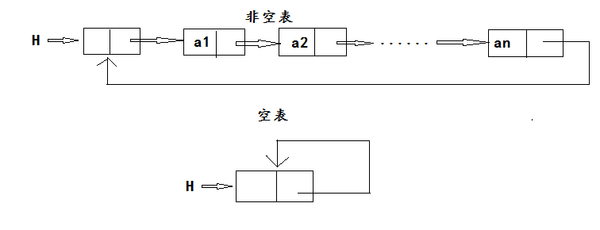

# 循环链表
## 定义
将链表通过指针域首尾相接，即链表尾结点的指针域指向头结点形成的链表叫做循环链表。


由单链表构成叫做单循环链表。

单循环链表在任意一结点都可以访问其他节点，用指针是否为null判断是否到达链表尾。一般使用尾结点的指针来表示，
提高效率。

## 代码 
循环链表操作：(由两个单链表构成循环链表，其中保留一个头结点作为尾结点)
- Length（L） 返回表L的长度，即表中元素个数
- Prior（L，i） 取位置i的前驱元素
- Next（L，i） 取位置i的后继元素
- Locate（L，x） 这是一个函数，函数值为元素x在L中的位置
- Insert（L，i，x）在表L的位置i处插入元素x，将原占据位置i的元素及后面的元素都向后推一个位置
- Delete（L，p） 从表L中删除位置p处的元素
- Get（L，i） 这是一个函数，函数值为L中位置i处的元素（1≤i≤n）
- IsEmpty(L) 如果表L为空表(长度为0)则返回true，否则返回false
- Clear（L）清除所有元素
- Traverse（L）遍历输出所有元素
- Update（L，i,x）修改元素
- 退出
- 清空命令行！
- 创建循环链表
```cpp
#include<iostream>
#include<cstdlib>
#include<malloc.h>
using namespace std;
typedef int dataType;
typedef struct Node{
	dataType data=-1;
	struct Node *next;
}LNode,*LinkedList;
//创建链表  
LinkedList linkedListCreateT() {
	int i = 1;
	LinkedList l = (LNode*)malloc(sizeof(LNode));
	LinkedList p;
	l->next = NULL;
	while (i != 21) {
		p = (LNode*)malloc(sizeof(LNode));
		p->data = i;
		++i;
		p->next = l->next;
		l->next = p;
	}
	return l;
}
LinkedList create() {
	LinkedList p = linkedListCreateT();
	LinkedList l = linkedListCreateT();
	LinkedList lb = l;
	LinkedList pb = p->next;
	while (l->next != NULL) {
		l = l->next;
	}
	LinkedList le = l;
	le->next = pb;
	free(p);
	while (pb->next != NULL) {
		pb = pb->next;
	}
	LinkedList pe = pb;
	pe->next = lb;
	cout << "循环链表创建成功" << endl;
	return lb;
}
//表中元素个数
int  linkedListLength(LinkedList l) {
	int i=0;
	LinkedList p=l;
	p = p->next;
	while (p!=l) {
		i++;
		p=p->next;
	}
	return i+1;
}
//函数值为L中位置i处的元素
void linkedListGet(LinkedList l,int i) {
		int j = 0;
		LinkedList p=l;	
		while (j!=i) {
			++j;
			p = p->next;
		}
		cout << i << "位置的元素是：" << p->data << endl; 
}
//取位置i的前驱元素
void linkedListPrior(LinkedList l, int i) {
		int j = 0;
		LinkedList p=l;
		while(j!=i-1) {
				++j;
				p = p->next;
		}
		if (p==l) {
			cout << "位置：" << i << "的前驱元素为:尾结点" << endl;
		}
		else cout << "位置：" << i << "的前驱元素为:" << p->data << endl;
}
//取位置i的后继元素
void linkedListNext(LinkedList l, int i) {
		int j = 0;
		LinkedList p=l;
		while(j!=i+1) {			
			++j;
			p = p->next;			
		}
		if (p == l){
			cout << "位置" << i << "的后驱是：尾结点"<< endl;
		}
		else cout << "位置" << i << "的后驱是：" << p->data << endl;
}
//元素x在L中的位置
void linkedListLocate(LinkedList l, dataType x) {
	int i = 0,flag=0;
	LinkedList p=l;
	while(i!=linkedListLength(l)){
			++i;
			if (p->data == x) {
				cout << x << "在表中的位置是：" << i << endl;
				flag++;
			}
			p = p->next;	
	}
	if(flag==0) cout<<"不在表中"<<endl;
}
//在表L的位置i处插入元素x
LinkedList linkedListInsert(LinkedList l,int i,dataType x) {
	int j = 0;
	LinkedList pri=l,s=l;
	LinkedList p = (LNode*)malloc(sizeof(LNode));
	p->data = x;
    while (j != i) {
		++j;
		pri = s;
		s = s->next;
	}
	pri->next = p;
	p->next = s;
	cout << "插入成功！" << endl;
	return l;
}
//删除位置i处的元素
LinkedList linkedListDelete(LinkedList l,int i) {
	int j = 0;
	LinkedList pri = l, p = l;
	while(j!=i){
		j++;
		pri = p;
		p = p->next;
	}
	pri->next = p->next;
	free(p);
	cout << "删除成功！" << endl;
	return l;
}
//表是否为空
void linkedListEmpty(LinkedList l) {
	if (l->next==l) {
		cout << "是空表！" << endl;
	}
	else cout << "不是空表！" << endl;
}
//清空表
LinkedList linkedListClear(LinkedList l) {
	LinkedList p=l,pri=l;
	p = p->next;
	while (p!=l) {
		pri = p;
		p = p->next;
		free(pri);
	}
	l->next = l;
	cout << "清空完成！" << endl;
	return l;
}
//遍历输出所有元素
void linkedListTraverse(LinkedList l) {
	LinkedList p=l;
	p=p->next;
	if (p!=l) {
		cout << "遍历结果是：";
		while (p != l) {
				cout << p->data << " ";
				p = p->next;
		}
		cout << endl;
	}else {
		cout << "空表不能遍历！" << endl;
	}
}
//将位置i的元素修改为x
LinkedList sqlListUpdate(LinkedList l,int i,dataType x) {
	LinkedList p=l;
	int j = 0;
	while(j!=i){
		++j;
		p = p->next;  
	}
	p->data = x;
	cout << "修改成功！" << endl;
	return l;
}
void print() {
	cout <<	"*********************************************"<<endl;
	cout <<	"*	1.链表的长度		   2.取位置i的前驱	 *"<< endl;
	cout <<	"*	3.取位置i的后驱		   4.元素x的位置	 *"<< endl;
	cout <<	"*	5.位置i处插入元素x	   6.删除位置i的元素 *"<< endl;
	cout << "*	7.取位置i的元素		   8.表是否为空		 *"<< endl;
	cout << "*	9.清空表			   10.遍历表		 *"<< endl;
	cout << "*	11.修改位置i的元素	   12.退出    		 *"<< endl;
	cout << "*	13.清空命令行		   14创建循环链表 	 *"<< endl;
	cout << "*********************************************"<< endl;
}
void main() {
	int m=0,i = 0,n=0;
	LinkedList l = create();
	print();
	while (1) {
		cin >> i;
		switch (i)
		{
		case 1:cout <<"链表的长度为："<<linkedListLength(l) << endl; break;
		case 2:cin >> m;linkedListPrior(l, m); break;
		case 3:cin >> m; linkedListNext(l, m); break;
		case 4:cin >> m; linkedListLocate(l, m); break;
		case 5:cin >> m >> n;l=linkedListInsert(l, m, n); break;
		case 6:cin >> m;l=linkedListDelete(l, m); break;
		case 7:cin >> m; linkedListGet(l, m);break;
		case 8:linkedListEmpty(l);break;
		case 9:l = linkedListClear(l);break;
		case 10:linkedListTraverse(l);break;
		case 11:cin >> m; cin >> n;l = sqlListUpdate(l,m,n); break;
		case 12:exit(0);
		case 13:system("cls"); print();break;
		case 14:l = create(); break;
		default:cout << "数字超出范围，请重新输入。" << endl; break;
		}
	}
}
```