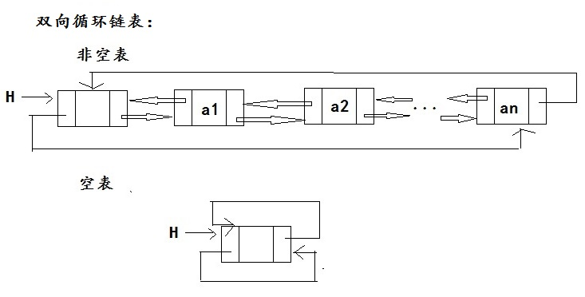

# 双向链表
## 定义
双链表：
每个结点有一个指向前驱的指针域和指向后继的指针域是链表可以进行双向查找，用这种结点结构组成的链表称为双链表。


双链表头尾相连构成双向循环链表。

## 代码
双链表的基本操作：（双链表没有循环）
- Length（L） 返回表L的长度，即表中元素个数
- Prior（L，i） 取位置i的前驱元素
- Next（L，i） 取位置i的后继元素
- Locate（L，x） 这是一个函数，函数值为元素x在L中的位置
- Insert（L，i，x）在表L的位置i处插入元素x，将原占据位置i的元素及后面的元素都向后推一个位置
- Delete（L，p） 从表L中删除位置p处的元素
- Get（L，i） 这是一个函数，函数值为L中位置i处的元素（1≤i≤n）
- Empty(L) 如果表L为空表(长度为0)则返回true，否则返回false
- Clear（L）清除所有元素
- Traverse（L）遍历输出所有元素
- Update（L，i,x）修改元素
- 退出
- 清空命令行！
- 创建双链表
```cpp
#include<iostream>
#include<cstdlib>
#include<malloc.h>
using namespace std;
typedef int dataType;
typedef struct Node{
	dataType data;
	struct Node *prior,*next;
}LNode,*LinkedList;
//创建链表  
LinkedList linkedListCreateT() {
	int i = 1;
	LinkedList l = (LNode*)malloc(sizeof(LNode));
	l->prior = l->next = NULL;
	LinkedList r = l;
	LinkedList p;
	while (i != 21) {
		p = (LNode*)malloc(sizeof(LNode));
		p->data = i;
		++i;
		p->next = r->next;
		p->prior = r;
		r->next = p;
		r = p;
	}
	cout << "双链表创建成功！" << endl;
	return l;
}
//表中元素个数
int  linkedListLength(LinkedList l) {
	int i=0;
	LinkedList p = l;
	while (p->next!=NULL) {
		i++;
		p=p->next;
	}
	return i;
}
//函数值为L中位置i处的元素
void linkedListGet(LinkedList l,int i) {
		int j = 0;
		LinkedList p=l;	
		while (j!=i) {
			++j;
			p = p->next;
		}
		cout << i << "位置的元素是：" << p->data << endl; 
}
//取位置i的前驱元素
void linkedListPrior(LinkedList l, int i) {
		int j = 0;
		LinkedList p=l;
		while(j!=i) {
				++j;
				p = p->next;
		}
		if (i==1) {
			cout << "位置：" << i << "的前驱元素为:空" << endl;
		}
		else cout << "位置：" << i << "的前驱元素为:" << p->prior->data << endl;
}
//取位置i的后继元素
void linkedListNext(LinkedList l, int i) {
		int j = 0;
		LinkedList p=l;
		while(j!=i) {			
			++j;
			p = p->next;			
		}
		if (i == linkedListLength(l)){
			cout << "位置" << i << "的后驱是：空"<< endl;
		}
		else cout << "位置" << i << "的后驱是：" << p->next->data << endl;
}
//元素x在L中的位置
void linkedListLocate(LinkedList l, dataType x) {
	int i = 0,flag=0;
	LinkedList p=l->next;
	while(i!=linkedListLength(l)){
			++i;
			if (p->data == x) {
				cout << x << "在表中的位置是：" << i << endl;
				flag++;
			}
			p = p->next;	
	}
	if(flag==0) cout<<"不在表中"<<endl;
}
//在表L的位置i处插入元素x
LinkedList linkedListInsert(LinkedList l,int i,dataType x) {
	int j = 0;
	LinkedList s=l;
	LinkedList p = (LNode*)malloc(sizeof(LNode));
	p->data = x;
    while (j != i) {
		++j;
		s = s->next;
	}
	s->prior->next = p;
	p->next = s;
	s->prior = p;
	cout << "插入成功！" << endl;
	return l;
}
//删除位置i处的元素
LinkedList linkedListDelete(LinkedList l,int i) {
	int j = 0;
	LinkedList p = l;
	while(j!=i){
		j++;
		p = p->next;
	}
	p->prior->next = p->next;
	p->next->prior = p->prior;
	free(p);
	cout << "删除成功！" << endl;
	return l;
}
//表是否为空
void linkedListEmpty(LinkedList l) {
	if (l->next==NULL) {
		cout << "是空表！" << endl;
	}
	else cout << "不是空表！" << endl;
}
//清空表
LinkedList linkedListClear(LinkedList l) {
	LinkedList p = l;
	if (l->next == NULL) {
		cout << "空表不能进行清除！" << endl;
		return l;
	}
	else {
		p = p->next;
		while (p->next!=NULL) {
			p = p->next;
			free(p->prior);
		}
		free(p);
		l->next = NULL;
		cout << "清空完成！" << endl;
	}
	return l;
}
//遍历输出所有元素
void linkedListTraverse(LinkedList l) {
	LinkedList p=l;
	if (p->next!=NULL) {
		p = p->next;
		cout << "遍历结果是：";
		while (p->next!= NULL) {
				cout << p->data << " ";
				p = p->next;
		}
		cout <<p->data<< endl;
	}else {
		cout << "空表不能遍历！" << endl;
	}
}
//将位置i的元素修改为x
LinkedList sqlListUpdate(LinkedList l,int i,dataType x) {
	LinkedList p=l;
	int j = 0;
	while(j!=i){
		++j;
		p = p->next;  
	}
	p->data = x;
	cout << "修改成功！" << endl;
	return l;
}
void print() {
	cout <<	"*********************************************"<<endl;
	cout <<	"*	1.链表的长度		   2.取位置i的前驱	 *"<< endl;
	cout <<	"*	3.取位置i的后驱		   4.元素x的位置	 *"<< endl;
	cout <<	"*	5.位置i处插入元素x	   6.删除位置i的元素 *"<< endl;
	cout << "*	7.取位置i的元素		   8.表是否为空		 *"<< endl;
	cout << "*	9.清空表			   10.遍历表		 *"<< endl;
	cout << "*	11.修改位置i的元素	   12.退出    		 *"<< endl;
	cout << "*	13.清空命令行		   14双链表     	 *"<< endl;
	cout << "*********************************************"<< endl;
}
void main() {
	int m=0,i = 0,n=0;
	print();
	LinkedList l = linkedListCreateT();
	while (1) {
		cin >> i;
		switch (i)
		{
		case 1:cout <<"链表的长度为："<<linkedListLength(l) << endl; break;
		case 2:cin >> m;linkedListPrior(l, m); break;
		case 3:cin >> m; linkedListNext(l, m); break;
		case 4:cin >> m; linkedListLocate(l, m); break;
		case 5:cin >> m >> n;l=linkedListInsert(l, m, n); break;
		case 6:cin >> m;l=linkedListDelete(l, m); break;
		case 7:cin >> m; linkedListGet(l, m);break;
		case 8:linkedListEmpty(l);break;
		case 9:l = linkedListClear(l);break;
		case 10:linkedListTraverse(l);break;
		case 11:cin >> m; cin >> n;l = sqlListUpdate(l,m,n); break;
		case 12:exit(0);
		case 13:system("cls"); print();break;
		case 14:l = linkedListCreateT(); break;
		default:cout << "数字超出范围，请重新输入。" << endl; break;
		}
	}
}
```
