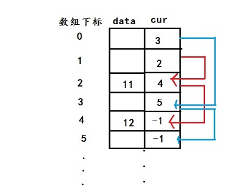
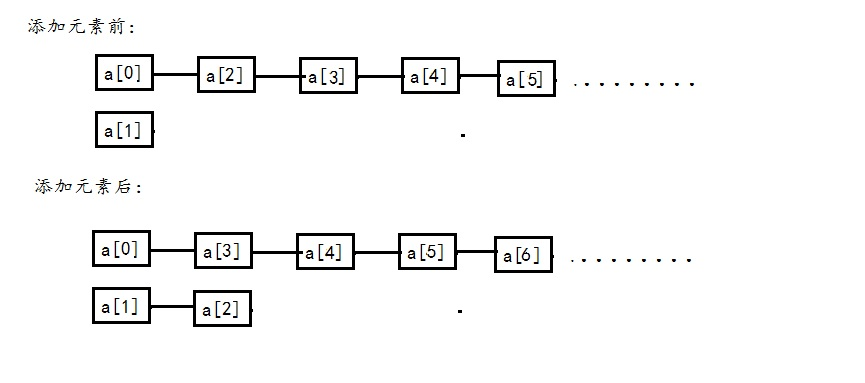

# 静态链表
静态链表：用数组描述的链表。而且静态链表的表现形式即为结构体数组，结构体变量包括数据域data和游标CUR（我用的是next）data中存放的是储存的元素值。

cur中存放的是下一元素的数组下标。



我对静态链表的理解就是：静态链表表面上是一个结构体数组，但是逻辑上是两个数组，一个数组首元素的下标是0，它连接的是
所有空闲的结点。另一个数组首元素下标是1，它表示的是正在使用的所有结点，静态链表的各种操作也主要围绕这逻辑上的两个数组。
假如创建了一个如上形式的结构体数组 a[100],经过初始化之后形成一个空的静态链表，当我们为一个空静态链表执行添加元素操作时：



静态链表的删除等操作都与之类似。
## 代码
静态链表的基本操作：
- add() 添加结点元素                     
- Delete()  删除节点元素
- Update() 修改节点元素
- Get()查询结点元素 
- Traverse()遍历静态链表
- 清空
```cpp
#include<iostream>
#include<vector>
using namespace std;
#define  max  100
typedef int  Elemtype;
typedef struct {
	Elemtype data;
	int next;
} Slist[max];
//初始化
void init(Slist &a) {	
	for (int i = 0; i != max; i++) {
		a[i].next= i+1;
	}
	a[max - 1].next= -1;
	a[0].next = 2;
	a[1].next = -1;
}
//申请空闲结点
int malloc_init(Slist &a) {
	int i = a[0].next;
	if (i) {
		a[0].next = a[i].next;
	}
	return i;
}
//添加元素
void add(Slist &a,Elemtype x) {
	int y=1;
    int i= malloc_init(a);
	while (a[y].next != -1) {
		y = a[y].next;
	}
	a[i].data = x;
	a[y].next = i;
	a[i].next = -1;
	cout << "添加成功！" << endl;
}
//删除元素
void Delete(Slist &a,Elemtype x) {
	int i = 1,y=0;
	while (a[i].data != x) {
		y = i;
		i = a[i].next;
	}
		a[y].next = a[i].next;
		a[i].data = a[0].data;
		a[i].next = a[0].next;
		a[0].next = i;
	cout << "删除成功！" << endl;
}
//修改元素
void Update(Slist &a,Elemtype x, Elemtype y) {
	int i = 1;
	while (a[i].data != x) {
		i = a[i].next;
	}
	a[i].data = y;
	cout << "修改成功！" << endl;
}
//查询元素
void Get(Slist &a,Elemtype x) {
	int i = 1;
	while (a[i].data != x) {
		i = a[i].next;
	}
	if (i == -1) {
		cout << "此链表没有该元素！" << endl;
	}
	else {
		cout << x << "的位置是:" << i << endl;
	}	
}
//遍历输出所有元素
void Traverse(Slist &a){
	int i = 1;
	if (a[i].next == -1) {
		cout << "链表为空！" << endl;
	}else{
	cout << "遍历的结果是：";
	while (a[i].next != -1) {
		cout << a[a[i].next].data << " ";
		i = a[i].next;
	}
	cout << endl;
	}
}
void print() {
	cout << "*********************************************" << endl;
	cout << "*   1 添加结点元素       2 删除节点元素     *" << endl;
	cout << "*   3 修改节点元素       4 查询结点元素     *" << endl;
	cout << "*   5 遍历静态链表       6 清空             *" << endl;
	cout << "*********************************************" << endl;
}
void main() {
	int i = 0;
	Elemtype m, n;
	Slist a;
	init(a);
	print();
	while (1) {
		cin >> i;
		switch (i) {
		case 1:cin >> m; add(a, m);break;
		case 2:cin >> m; Delete(a, m); break;
		case 3:cin >> m >> n; Update(a, m, n); break;
		case 4:cin >> n; Get(a, m);break;
		case 5:Traverse(a);break;
		case 6:system("cls"); print(); break;
		default:cout << "输入数字不符合请重新输入！"<<endl; break;
		}
	}
	system("pause");
}
```