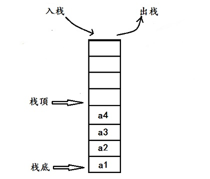

# 栈
## 定义
栈是只允许在表尾进行插入、删除的线性表。对栈来说，表尾有特殊的含义，我们将表尾称为栈顶，而表的另一端，即表头称为栈底。不含元素的空表称为空栈。由其定义可以看出先进入栈的元素最后才能出栈，所以栈又被称为后进先出的线性表。
    若栈满，执行进栈则发生上溢。若栈空，执行退栈则发生下溢。


栈分两种：
- 利用顺序存储结构实现的栈称为顺序栈
- 利用链式存储结构实现的栈称为链栈

## 代码
两种栈的基本实现操作：
- Init()   初始化
- Empty()  判栈空
- Push()   入栈
- Pop()    出栈
- GetTop() 读栈顶元素
- Clear()  清空栈
- Length() 求栈长
### 顺序栈
```cpp
#include<iostream>
using namespace std;
#define MAXSIZE 100
typedef int ElemType;
typedef struct {
	ElemType data[MAXSIZE];
	int top;
}Stack;
Stack Init() {
	Stack s;
	s.top = -1;
	return s;
}
void Empty(Stack s) {
	if (s.top == -1) {
		cout <<"栈为空！" << endl;
	}
	else cout << "栈不为空！" << endl;
}
Stack Push(Stack s,ElemType a) {
	if (s.top == MAXSIZE - 1) {
		cout << "栈满！压栈失败！" << endl;
	}
	else {
		s.top++;
		s.data[s.top] =a;
		cout << "压栈成功！" << endl;
	}
	return s;
}
Stack Pop(Stack s) {
	if (s.top == -1) {
		cout << "栈为空！没有元素出栈" << endl;
	}
	else {
		cout << s.data[s.top] << endl;
		s.top--;
	}
	return s;
}
void GetTop(Stack s) {
	if (s.top != -1) {
		cout << "栈顶元素是：" << s.data[s.top] << endl;
	}
	else {
		cout << "空栈，没有栈顶元素" << endl;
	}
}
Stack clear(Stack s) {
	s.top = -1;
	cout << "清除成功！" << endl;
	return s;
}
void Length(Stack s) {
	cout << "栈的长度为：" << s.top+1<< endl;
}
void print() {
	cout << "*******************************************" << endl;
	cout << "*   1判断栈是否为空          2入栈        *" << endl;
	cout << "*   3出栈                    4读栈顶元素  *" << endl;
	cout << "*   5清空栈                  6求栈长      *" << endl;
	cout << "*   7 清屏                   8 退出       *" << endl;
	cout << "*******************************************" << endl;
}
void main() {
	int i,x;
	Stack s = Init();
	print();
	while (1) {
		cin >> i;
		switch (i)
		{
		case 1:Empty(s); break;
		case 2:cin >> x; s=Push(s, x); break;
		case 3:s=Pop(s); break;
		case 4:GetTop(s); break;
		case 5:s=clear(s); break;
		case 6:Length(s); break;
		case 7:system("cls"); print(); break;
		case 8:exit(0); break;
		default:cout << "输出值超出范围，请重新输入！"<<endl; break;
		}
	}
    
}
```
### 链栈
```cpp
#include<iostream>
using namespace std;
#define MAXSIZE 100
typedef int ElemType;
typedef struct StackNode{
	ElemType data;
	StackNode *next;
}StackNode,*LinkedStack;
LinkedStack Init() {
	LinkedStack s;
	s = NULL;
	return s;
}
void Empty(LinkedStack s) {
	if (s == NULL) {
		cout <<"栈为空！" << endl;
	}
	else cout << "栈不为空！" << endl;
}
LinkedStack Push(LinkedStack s,ElemType a) {
	LinkedStack p = (StackNode*)malloc(sizeof(StackNode));
	p->data = a;
	p->next = s;
	s = p;	
	cout << "压栈成功！" << endl;	
	return s;
}
LinkedStack Pop(LinkedStack s) {
	if (s==NULL) {
		cout << "栈为空！没有元素出栈" << endl;
	}
	else {
		cout << s->data << endl;
		s = s->next;
	}
	return s;
}
void GetTop(LinkedStack s) {
	if (s != NULL) {
		cout << "栈顶元素是：" << s->data << endl;
	}
	else {
		cout << "空栈，没有栈顶元素" << endl;
	}
}
LinkedStack clear(LinkedStack s) {
	LinkedStack p;
	while (s!= NULL) {
		p = s;
		s = s->next;
		free(p);
	}
	cout << "清除成功！" << endl;
	return s;
}
void Length(LinkedStack s) {
	int i = 0;
	while (s!=NULL) {
		i++;
		s = s->next;
	}
	cout << "栈的长度为：" << i << endl;
}
void print() {
	cout << "*******************************************" << endl;
	cout << "*   1判断栈是否为空          2入栈        *" << endl;
	cout << "*   3出栈                    4读栈顶元素  *" << endl;
	cout << "*   5清空栈                  6求栈长      *" << endl;
	cout << "*   7 清屏                   8 退出       *" << endl;
	cout << "*******************************************" << endl;
}
void main() {
	int i,x;
	LinkedStack s = Init();
	print();
	while (1) {
		cin >> i;
		switch (i)
		{
		case 1:Empty(s); break;
		case 2:cin >> x; s=Push(s, x); break;
		case 3:s=Pop(s); break;
		case 4:GetTop(s); break;
		case 5:s=clear(s); break;
		case 6:Length(s); break;
		case 7:system("cls"); print(); break;
		case 8:exit(0); break;
		default:cout << "输出值超出范围，请重新输入！"<<endl; break;
		}
	}
    
}
```