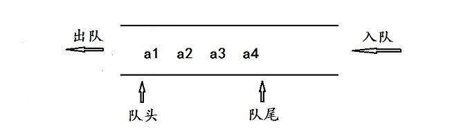
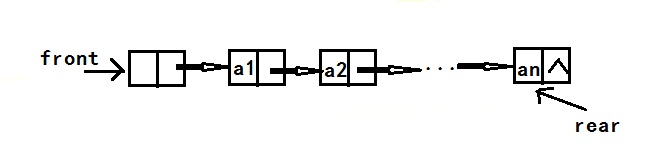
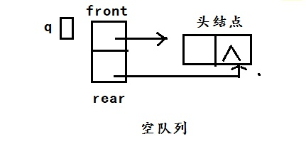

# 队列
## 定义
队列是一种只允许在表的一端插入，在另外一段删除的存取受限的线性表。允许插入的一端称为队尾，允许删除的一端称为对头。像排队一样，先进入队列的元素先出队列。所以队列是一种先进先出的线性表。



除了栈和队列之外，还有一种限定性数据结构称为双端队列。双端队列是限定插入和删除操作在表的两端进行的线性表。实际使用中，还有输入受限的双端队列（一段输入，两端输出）和输出受限的双端队列（一端输出，两端输入）。这几种数据结构应用远不如栈和队列广泛。

队列也是操作受限的线性表，与线性表、栈类似，队列也有顺序存储结构和链式存储两种存储结构。

## 循环队列--队列的顺序存储结构
区别队满和队空有两种方法：
- 是另设一标志位以区分队列是空还是不空，
- 是少用一个元素空间，以队尾指针加1等于队头指针作为队满的标志，此时的状态是：（rear+1）%MAXSIZE = front

循环队列的核心就是 %MAXSIZE，取余的结果永远<=MAXSIZE,从而形成了一个循环！

### 代码：
```cpp
#include<iostream>
#include<sstream>
using namespace std;
#define MAXSIZE 100
typedef int Element;
typedef struct {
	Element data[MAXSIZE];
	int front, rear;
}Sequeue;
//初始化
Sequeue Init() {
	Sequeue q;
	q.rear = q.front = 0;
	return q;
}
//入队
Sequeue SeqIn(Sequeue q,int x) {
	if ((q.rear + 1) % MAXSIZE == q.front) {
		cout << "队满，入队失败！" << endl;
	}
	else {
		q.data[q.rear] = x;
		q.rear = (q.rear + 1) % MAXSIZE;
		cout << "入队成功！" << endl;
	}
	return q;
}
//出队
Sequeue SeqOut(Sequeue q) {
	if (q.front == q.rear) {
		cout << "队空，无法出队！" << endl;
	}
	else {
		cout << "出队元素是：" << q.data[q.front] << endl;
		q.front = (q.front + 1) % MAXSIZE;
	}
	return q;
}
//读队头元素
void SeqHead(Sequeue q) {
	if (q.front == q.rear) {
		cout << "队空,没有队头元素" << endl;
	}
	else {
		cout << "队头元素是：" << q.data[q.front] << endl;
	}
}
//判断空
void SeqEmpty(Sequeue q) {
	if (q.front == q.rear) {
		cout << "队为空！" << endl;
	}
	else {
		cout << "队不为空！" << endl;
	}
}
//求队列长
void SeqLength(Sequeue q) {
	cout << "对列长为:";
	cout << (q.rear - q.front + MAXSIZE) % MAXSIZE << endl;
}
void print() {
	cout << "******************************************" << endl;
	cout << "* 1 入队                  2 出队         *" << endl;
	cout << "* 3 读队头元素            4 判断空       *" << endl;
	cout << "* 5 队列长度              6 清屏         *" << endl;
	cout << "* 7退出                                  *" << endl;
	cout << "******************************************" << endl;
}
void main() {
	int i, m;
	Sequeue q = Init();
	print();
	while (1) {
		cin >> i;
		switch (i) {
		case 1:cin >> m; q = SeqIn(q, m); break;
		case 2:q = SeqOut(q); break;
		case 3:SeqHead(q); break;
		case 4:SeqEmpty(q); break;
		case 5:SeqLength(q); break;
		case 6:system("cls"); print(); break;
		case 7:exit(0); break;
		default:cout << "输入错误，请重新输入！" << endl; break;
		}
	}
}
```
## 链队列--队列的链式表示和实现
 用链式存储结构表示的队列简称为链队列。一个链队列显然需要两个分别指示队头和队尾的指针（分别称为头指针和尾指针）才能唯一确定。和线性表的单链表一样，为了操作上的方便，我们也给链队列增加一个头结点，令头指针指向头结点，尾指针指向尾结点。
 

 头指针front和尾指针rear是两个独立的指针变量，从结构上考虑，通常将二者封装在一个结构中。链表的类型描述如下：
 ```cpp
 typedef struct LQNode{
	Element data;
	struct LQNode *next;
}LQNode,*LinkedQNode;         //链队列结点类型

typedef struct {
	struct LQNode *front, *rear;   //头指针和尾指针
}LQueue,*LinkedQueue;                //将头指针和尾指针封装在一起的链队列
 ```

 形成的队列结构是：

 

### 代码
```cpp
#include<iostream>
#include<sstream>
using namespace std;
#define MAXSIZE 100
typedef int Element;
typedef struct LQNode{
	Element data;
	struct LQNode *next;
}LQNode,*LinkedQNode;         //链队列结点类型
typedef struct {
	struct LQNode *front, *rear;   //头指针和尾指针
}LQueue,*LinkedQueue;                //将头指针和尾指针封装在一起的链队列
//初始化
LinkedQueue LinkedQueueInit() {
	LinkedQueue q;
	LinkedQNode p;
	q = (LQueue*)malloc(sizeof(LQueue));
	p = (LQNode*)malloc(sizeof(LQNode));
	p->next = NULL;
	q->front = q->rear = p;
	return q;
}
//入队
LinkedQueue LinkedQueueIn(LinkedQueue q,Element x) {
	LinkedQNode p = (LQNode*)malloc(sizeof(LQNode));
	p->data = x;
	p->next = NULL;
	q->rear->next = p;
	q->rear = p;
	cout << "入队成功！" << endl;
	return q;
}
//出队
LinkedQueue LinkedQueueOut(LinkedQueue q) {
	if (q->front==q->rear) {
		cout << "队空，无法出队！" << endl;
	}
	else {
		LinkedQNode p;
		p = q->front->next;
		cout << "出队元素是：" << p->data << endl;
		q->front->next = p->next;
		free(p);
		if (q->front->next == NULL) {
			q->rear = q->front;
		}
	}
	return q;
}
//读队头元素
void LinkedQueueHead(LinkedQueue q) {
	if (q->front == q->rear) {
		cout << "队空,没有队头元素" << endl;
	}
	else {
		cout << "队头元素是：" << q->front->next->data << endl;
	}
}
//判断空
void LinkedQueueEmpty(LinkedQueue q) {
	if (q->front == q->rear) {
		cout << "队为空！" << endl;
	}
	else {
		cout << "队不为空！" << endl;
	}
}
//求队列长
void LinkedQueueLength(LinkedQueue q) {
	int i = 0;
	LinkedQNode p;
	p = q->front;
	while (p->next != NULL) {
		p = p->next;
		i++;
	}
	cout << "对列长为:" << i << endl;
}
void print() {
	cout << "******************************************" << endl;
	cout << "* 1 入队                  2 出队         *" << endl;
	cout << "* 3 读队头元素            4 判断空       *" << endl;
	cout << "* 5 队列长度              6 清屏         *" << endl;
	cout << "* 7退出                                  *" << endl;
	cout << "******************************************" << endl;
}
void main() {
	int i, m;
	LinkedQueue q = LinkedQueueInit();
	print();
	while (1) {
		cin >> i;
		switch (i) {
		case 1:cin >> m; q = LinkedQueueIn(q, m); break;
		case 2:q = LinkedQueueOut(q); break;
		case 3:LinkedQueueHead(q); break;
		case 4:LinkedQueueEmpty(q); break;
		case 5:LinkedQueueLength(q); break;
		case 6:system("cls"); print(); break;
		case 7:exit(0); break;
		default:cout << "输入错误，请重新输入！" << endl; break;
		}
	}
}
```
