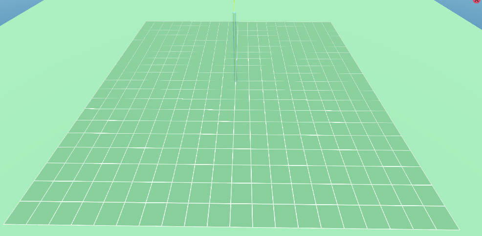

# 在表面绘制二维网格

最近想做一些东西，但是得利用游戏引擎来完成。之前跟了一个unity实现网格系统的教程，但是我想在godot中实现类似的效果。但是godot教程不多，那只能我自己慢慢摸索了。

## 效果

## 代码
```cpp
shader_type spatial;

uniform vec2 object_scale = vec2(1,1);
uniform vec2 default_value = vec2(10,10);
uniform vec2 size = vec2(1,1);
uniform vec2 offset = vec2(0,0);
uniform vec4 grid_color = vec4(1,1,1,1);
uniform float thickness: hint_range(0.001, 0.05, 0.01) = 0.05;

vec2 tilling_and_offset(vec2 uv, vec2 tilling, vec2 offset_value){
	vec2 result = uv * tilling;
	result += offset_value;
	return result;
}

vec2 saturate(vec2 value) {
    return vec2(clamp(value.x, 0.0, 1.0), clamp(value.y, 0.0, 1.0));
}


float rectangle(vec2 uv, float width,float height){
	vec2 d = abs(uv * 2.0 -vec2(1,1)) - vec2(width, height);
	d = vec2(1,1)-d / fwidth(d);
	d = saturate(d);
	return min(d.x,d.y);
}

void fragment() {
	vec2 default_grid_count = vec2(default_value.x * object_scale.x,default_value.y * object_scale.y); // 默认格子数量是10x10
	default_grid_count  *= size; // 乘以size 可以增加或减少格子数量
	float grid_size = 1.0 - thickness; //单个格子的大小
	vec2 resize_uv =  tilling_and_offset(UV,default_grid_count,offset);
	resize_uv = fract(resize_uv);
	float value = rectangle(resize_uv,grid_size,grid_size);
	if(!isinf(value)){
		vec4 color = vec4(value,value,value,1);
		color = vec4(1,1,1,1) - color;
		color = grid_color * color;
		ALBEDO = vec3(color.r,color.g,color.b);
		ALPHA = 0.4;
	}
}
```